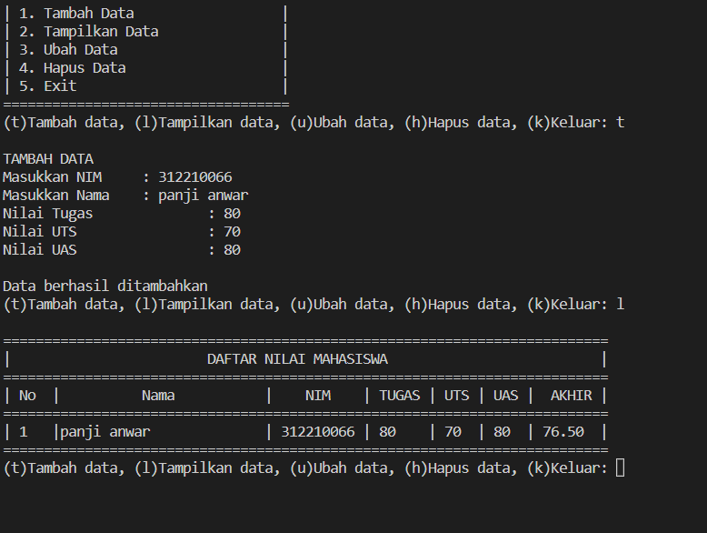
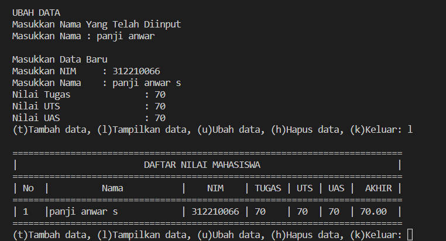
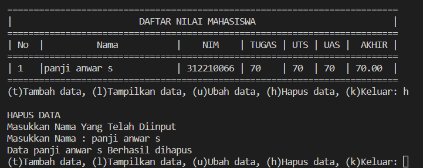
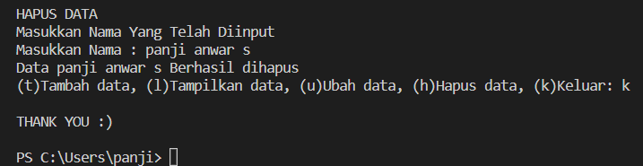

# praktikum8
```bash
Nama    : Panji Anwar Sanusi
NIM     : 312210066
Kelas   : TI.22.C1

```

```bash

Buat program sederhana dengan mengaplikasikan penggunaan class. Buatlah
class untuk menampilkan daftar nilai mahasiswa, dengan ketentuan:

• Method tambah() untuk menambah data

• Method tampilkan() untuk menampilkan data

• Method hapus(nama) untuk menghapus data berdasarkan nama

• Method ubah(nama) untuk mengubah data berdasarkan nama

```


### Penjelasan

- Langka pertama adalah mendeklarasikan sebuahclass Mahasiswa(): yang didalamnya terdapat atribut NIM, Nama, nilai tugas, nilai UTS dan nilai UAS. Untuk mendeklarasikan sebuah class didalam OOP kita harus gunakan def__init__ dan juga self.

- Selanjutnya membuat table sebuah menu kita dapat menggunakan fungsimenutabel(): yang didalamnya terdapat program sebuah menu yang dapat di input. 

- Lalu kita perlu menambahkan metode seperti tambah, lihat, hapus dan mengubah data mahasiswa kita dapat menggunakan append()agar data yang terakhir ditambahkan  ada di urutan list paling akhir.kita bisa masukan data tersebut kedalam metod tambah().

- selanjutnya kita perlu menambahkan Method lihat() Berguna untuk menampilkan seluruh data yang telah ditambahkan. Bila mana data tersebut belum diinput/data tersebut sudah terhapus, Maka akan keluar ouput dengan tulisan "TIDAK ADA DATA". Kita menggunakan for loop untuk menampilkan banyaknya data. 

```bash
 menutabel()

    def __init__(self, nim, nama, tugas, uts, uas):
        self.nim = nim
        self.nama = nama
        self.tugas = tugas
        self.uts = uts
        self.uas = uas

    def tambah(self, nim, nama, tugas, uts, uas):
        data.nim.append(nim)
        data.nama.append(nama)
        data.tugas.append(tugas)
        data.uts.append(uts)
        data.uas.append(uas)

    def lihat(self):
        for i in range(len(data.nama)):
            print("|", i + 1, "  |", end="")
            print('{0:<25}'.format(self.nama[i]), end="")
            print("|", self.nim[i], end="")
            print(" |", self.tugas[i], end="")
            print("    |", self.uts[i], end="")
            print("  |", self.uas[i], " | ", end="")
            print(f'{((self.tugas[i] * 30 / 100) + (self.uts[i] * 35 / 100) + (self.uas[i] * 35 / 100)) :.2f}', " |")
```


- dan buatlah Method ubah() ini berfungsi sebagai menu mengubah data yang telah diinput, Inputan tersebut didalamnya terdapat atribut nama, Sedangkan untuk penginputan sebuah nim, tugas, uts, dan uas dapat kita ubah sesuai kebutuhan.

```bash
def ubah(self, nim, nama, tugas, uts, uas):
        self.nim[no] = nim
        self.nama[no] = nama
        self.tugas[no] = tugas
        self.uts[no] = uts
        self.uas[no] = uas
```


- selanjutnya buatlah Method hapus() ini berfungsi untuk penghapusan sebuah data pada program yang sebelumnya telah diinput. Dan inputan dari kodingan ini berdasarkan "nama" yang sebelumnya telah diinput. 

```bash
def hapus(self):
        del self.nim[no]
        del self.nama[no]
        del self.tugas[no]
        del self.uts[no]
        del self.uas[no]
```

- Untuk menjalankan program sama seperti tugas sebelumnya,kita bisa input melalui masing-masing methods, seperti pada sebuah while loop yang didalamnya Terdapat conditional.
- yang terakhir jika data sudah selesai diinput, Pilih menu ke (Keluar) yaitu "k", Maka program secara otomatis akan berhenti. 


### Berikut Codingannya

```bash
class Mahasiswa():

    def menutabel():
        print("=" * 35)
        print("|  PROGRAM INPUT NILAI MAHASISWA  |")
        print("=" * 35)
        print('| 1. Tambah Data                  |')
        print('| 2. Tampilkan Data               |')
        print('| 3. Ubah Data                    |')
        print('| 4. Hapus Data                   |')
        print('| 5. Exit                         |')
        print("=" * 35)

    menutabel()

    def __init__(self, nim, nama, tugas, uts, uas):
        self.nim = nim
        self.nama = nama
        self.tugas = tugas
        self.uts = uts
        self.uas = uas

    def tambah(self, nim, nama, tugas, uts, uas):
        data.nim.append(nim)
        data.nama.append(nama)
        data.tugas.append(tugas)
        data.uts.append(uts)
        data.uas.append(uas)

    def lihat(self):
        for i in range(len(data.nama)):
            print("|", i + 1, "  |", end="")
            print('{0:<25}'.format(self.nama[i]), end="")
            print("|", self.nim[i], end="")
            print(" |", self.tugas[i], end="")
            print("    |", self.uts[i], end="")
            print("  |", self.uas[i], " | ", end="")
            print(f'{((self.tugas[i] * 30 / 100) + (self.uts[i] * 35 / 100) + (self.uas[i] * 35 / 100)) :.2f}', " |")

    def ubah(self, nim, nama, tugas, uts, uas):
        self.nim[no] = nim
        self.nama[no] = nama
        self.tugas[no] = tugas
        self.uts[no] = uts
        self.uas[no] = uas

    def hapus(self):
        del self.nim[no]
        del self.nama[no]
        del self.tugas[no]
        del self.uts[no]
        del self.uas[no]

data = Mahasiswa([], [], [], [], [])

while True:
    menu = input("(t)Tambah data, (l)Tampilkan data, (u)Ubah data, (h)Hapus data, (k)Keluar: ")

    if menu == "t":
        print("\nTAMBAH DATA")
        data.tambah(
            input("Masukkan NIM \t : "),
            input("Masukkan Nama\t : "),
            int(input("Nilai Tugas\t\t : ")),
            int(input("Nilai UTS\t\t : ")),
            int(input("Nilai UAS\t\t : "))
        )
        print("\nData berhasil ditambahkan")

    elif menu == "l":
        print()
        print("=" * 74)
        print("|                        DAFTAR NILAI MAHASISWA                          |")
        print("=" * 74)
        print("| No  |          Nama           |    NIM    | TUGAS | UTS | UAS |  AKHIR |")
        print("=" * 74)
        if len(data.nama) != 0:
            data.lihat()
        else:
            print("|                             TIDAK ADA DATA                             |")
        print("=" * 74)

    elif menu == "u":
        print("\nUBAH DATA")
        print("Masukkan Nama Yang Telah Diinput")
        ubah = input("Masukkan Nama : ")
        if ubah in data.nama:
            no = data.nama.index(ubah)
            print()
            print("Masukkan Data Baru")
            data.ubah(
                input("Masukkan NIM \t : "),
                input("Masukkan Nama\t : "),
                int(input("Nilai Tugas\t\t : ")),
                int(input("Nilai UTS\t\t : ")),
                int(input("Nilai UAS\t\t : "))
            )
        else:
            print(ubah, "DATA TIDAK DITEMUKAN")

    elif menu == "h":
        print("\nHAPUS DATA")
        print("Masukkan Nama Yang Telah Diinput")
        hapus = input("Masukkan Nama : ")
        if hapus in data.nama:
            no = data.nama.index(hapus)
            data.hapus()
            print("Data", hapus, "Berhasil dihapus")
        else:
            print(hapus, "DATA TIDAK DITEMUKAN")

    elif menu == "k":
        print("\nTHANK YOU :)\n")
        break
    else:
        print("\nPerintah yang dimasukkan salah!\n")
```


### Hasil Output

- Menambahkan Data dengan input "t" dan Menampilkan Data dengan input "l"




- Mengubah Data dengan input "u"




- Menghapus Data dengan input "h"




- Keluar dengan input "k"




### Berikut Flowchartnya


TERIMA KASIH
